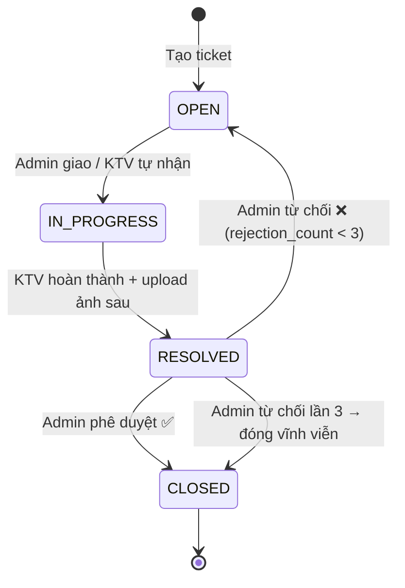

# 3. Use Case Diagram
## Hệ Thống Quản Lý Biển Báo Bệnh Viện

---

## 3.1 Tổng Quan Actor & Use Case

### Actor

| Actor | Mô Tả | Quyền Truy Cập |
|-------|-------|----------------|
| **Admin** | Quản trị viên hệ thống | Toàn bộ hệ thống |
| **Technician** | Kỹ thuật viên bảo trì | Dashboard, ticket, xem asset |
| **Public** | Bệnh nhân / khách vãng lai | Wayfinding, xem QR scan |
| **System** | Hệ thống (timer, automation) | Gửi thông báo, backup DB |

---

## 3.2 Use Case Diagram Tổng Thể

```mermaid
graph TB
    subgraph Actors
        Admin["👤 Admin"]
        Tech["👷 Technician"]
        Public["👥 Public\n(Patient/Visitor)"]
    end

    subgraph AUTH["🔐 Authentication Module"]
        UC_Login["UC01\nĐăng nhập"]
        UC_Refresh["UC02\nGia hạn token"]
        UC_Logout["UC03\nĐăng xuất"]
        UC_ChangePass["UC04\nĐổi mật khẩu"]
    end

    subgraph ASSET["📋 Asset Management Module"]
        UC_CreateAsset["UC10\nTạo biển báo"]
        UC_EditAsset["UC11\nSửa biển báo"]
        UC_DeleteAsset["UC12\nXóa biển báo"]
        UC_ViewAsset["UC13\nXem danh sách biển"]
        UC_AssetDetail["UC14\nXem chi tiết biển"]
        UC_SearchAsset["UC15\nTìm kiếm biển"]
        UC_UploadImage["UC16\nUpload ảnh biển"]
        UC_ManageSignType["UC17\nQuản lý loại biển"]
    end

    subgraph LOCATION["🏢 Location Module"]
        UC_CreateLoc["UC20\nTạo vị trí"]
        UC_EditLoc["UC21\nSửa vị trí"]
        UC_DeleteLoc["UC22\nXóa vị trí"]
        UC_ViewTree["UC23\nXem cây vị trí"]
    end

    subgraph TICKET["🎫 Maintenance Ticket Module"]
        UC_CreateTicket["UC30\nTạo ticket"]
        UC_AssignTicket["UC31\nPhân công KTV"]
        UC_TakeTicket["UC32\nTự nhận task"]
        UC_UpdateTicket["UC33\nCập nhật tiến độ"]
        UC_ApproveTicket["UC34\nPhê duyệt kết quả"]
        UC_RejectTicket["UC35\nTừ chối kết quả"]
        UC_ViewTickets["UC36\nXem danh sách ticket"]
        UC_TicketDashboard["UC37\nDashboard tổng hợp"]
    end

    subgraph MAP["🗺️ Map & Wayfinding Module"]
        UC_ManageFloor["UC40\nQuản lý bản đồ tầng"]
        UC_EditNode["UC41\nChỉnh sửa node"]
        UC_EditEdge["UC42\nChỉnh sửa edge"]
        UC_Wayfinding["UC43\nTìm đường"]
        UC_ViewMap["UC44\nXem bản đồ"]
    end

    subgraph USER["👥 User Management Module"]
        UC_CreateUser["UC50\nTạo tài khoản"]
        UC_EditUser["UC51\nSửa tài khoản"]
        UC_LockUser["UC52\nKhóa/Mở tài khoản"]
        UC_ResetPass["UC53\nReset mật khẩu"]
        UC_ManageRole["UC54\nQuản lý vai trò"]
        UC_AssignPerm["UC55\nGán quyền"]
    end

    subgraph QR["📱 QR Code Module"]
        UC_ScanQR["UC60\nQuét mã QR"]
        UC_ViewAssetPublic["UC61\nXem thông tin biển (public)"]
        UC_ReportFromQR["UC62\nBáo hỏng từ QR"]
    end

    %% Admin relationships
    Admin --> UC_Login
    Admin --> UC_ChangePass
    Admin --> UC_CreateAsset
    Admin --> UC_EditAsset
    Admin --> UC_DeleteAsset
    Admin --> UC_ViewAsset
    Admin --> UC_AssetDetail
    Admin --> UC_SearchAsset
    Admin --> UC_UploadImage
    Admin --> UC_ManageSignType
    Admin --> UC_CreateLoc
    Admin --> UC_EditLoc
    Admin --> UC_DeleteLoc
    Admin --> UC_ViewTree
    Admin --> UC_CreateTicket
    Admin --> UC_AssignTicket
    Admin --> UC_ApproveTicket
    Admin --> UC_RejectTicket
    Admin --> UC_ViewTickets
    Admin --> UC_TicketDashboard
    Admin --> UC_ManageFloor
    Admin --> UC_EditNode
    Admin --> UC_EditEdge
    Admin --> UC_ViewMap
    Admin --> UC_CreateUser
    Admin --> UC_EditUser
    Admin --> UC_LockUser
    Admin --> UC_ResetPass
    Admin --> UC_ManageRole
    Admin --> UC_AssignPerm

    %% Technician relationships
    Tech --> UC_Login
    Tech --> UC_ChangePass
    Tech --> UC_ViewAsset
    Tech --> UC_AssetDetail
    Tech --> UC_SearchAsset
    Tech --> UC_ScanQR
    Tech --> UC_ViewTickets
    Tech --> UC_TakeTicket
    Tech --> UC_UpdateTicket
    Tech --> UC_ReportFromQR

    %% Public relationships
    Public --> UC_ScanQR
    Public --> UC_ViewAssetPublic
    Public --> UC_Wayfinding
    Public --> UC_ViewMap

    %% Include relationships
    UC_CreateAsset -.->|include| UC_UploadImage
    UC_UpdateTicket -.->|include| UC_UploadImage
    UC_ScanQR -.->|include| UC_ViewAssetPublic
    UC_ReportFromQR -.->|include| UC_CreateTicket
    UC_AssignTicket -.->|extend| UC_CreateTicket

    style Admin fill:#4A90D9,color:#fff
    style Tech fill:#27AE60,color:#fff
    style Public fill:#E67E22,color:#fff
```

---

## 3.3 Mô Tả Chi Tiết Use Case

### UC01: Đăng Nhập

| Thuộc Tính | Nội Dung |
|-----------|---------|
| **ID** | UC01 |
| **Tên** | Đăng nhập hệ thống |
| **Actor chính** | Admin, Technician |
| **Mức độ** | User Goal |
| **Tiền điều kiện** | Người dùng có tài khoản active trong hệ thống |
| **Hậu điều kiện** | Người dùng có JWT access token hợp lệ |
| **Luồng chính** | 1. Mở trang `/login`; 2. Nhập username và password; 3. Nhấn "Đăng nhập"; 4. System xác thực credentials; 5. System trả về token; 6. Frontend lưu token; 7. Redirect theo role (Admin → /admin/assets, Tech → /tech/dashboard) |
| **Luồng thay thế** | A1: Nếu token còn hạn trong localStorage → bỏ qua login, redirect thẳng |
| **Luồng ngoại lệ** | E1: Sai mật khẩu → thông báo lỗi, tăng counter; E2: ≥5 lần sai → khóa 15 phút; E3: Account inactive → HTTP 403 |

---

### UC30: Tạo Ticket Bảo Trì

| Thuộc Tính | Nội Dung |
|-----------|---------|
| **ID** | UC30 |
| **Tên** | Tạo yêu cầu bảo trì |
| **Actor chính** | Admin, Technician |
| **Include** | UC16 (Upload ảnh – nếu đính kèm ảnh trước) |
| **Extend** | UC62 (Báo hỏng từ QR – trigger tạo ticket từ QR scan) |
| **Tiền điều kiện** | Biển báo (asset) tồn tại trong hệ thống |
| **Hậu điều kiện** | Ticket mới được tạo với status OPEN, reporter = current user |
| **Luồng chính** | 1. Chọn asset; 2. Mô tả vấn đề; 3. Chọn priority; 4. (Tùy chọn) Upload ảnh trước; 5. Submit; 6. Ticket tạo với status OPEN |

---

### UC33: Cập Nhật Tiến Độ Ticket

| State | Actor có thể chuyển | Điều kiện |
|-------|---------------------|-----------|
| OPEN → IN_PROGRESS | Admin (giao), Technician (tự nhận) | Ticket chưa có assignee (khi KTV nhận) |
| IN_PROGRESS → RESOLVED | Technician | Phải có imageAfter |
| RESOLVED → CLOSED | Admin | Phê duyệt sau khi kiểm tra ảnh |
| RESOLVED → OPEN | Admin | Từ chối; rejection_count tăng 1; max 3 lần |

---

### UC43: Tìm Đường (Wayfinding)

| Thuộc Tính | Nội Dung |
|-----------|---------|
| **ID** | UC43 |
| **Tên** | Tìm đường ngắn nhất |
| **Actor chính** | Public (bệnh nhân/khách) |
| **Tiền điều kiện** | Tồn tại ít nhất 2 node được kết nối trên bản đồ |
| **Đầu vào** | from (locationId), to (locationId), avoidStairs (boolean) |
| **Đầu ra** | Danh sách node tạo thành đường đi; hiển thị trên bản đồ |
| **Thuật toán** | Dijkstra với trọng số `weight` của edge |
| **Luồng chính** | 1. Bệnh nhân vào trang wayfinding; 2. Chọn điểm xuất phát; 3. Chọn điểm đến; 4. (Tùy chọn) chọn tránh cầu thang; 5. Nhấn "Tìm đường"; 6. Hệ thống tính Dijkstra; 7. Hiển thị đường trên bản đồ và mô tả từng bước |
| **Luồng ngoại lệ** | E1: Không có đường nối → thông báo "Không tìm được đường đi"; E2: Cùng tầng/cùng node → "Bạn đang ở vị trí này rồi" |

---

## 3.4 Quan Hệ Include / Extend

| Use Case | Quan Hệ | Use Case Con |
|----------|---------|-------------|
| UC10 (Tạo biển) | **include** | UC16 (Upload ảnh) – khi đính kèm ảnh |
| UC33 (Cập nhật ticket) | **include** | UC16 (Upload ảnh) – khi nộp ảnh before/after |
| UC60 (Quét QR) | **include** | UC61 (Xem thông tin biển public) |
| UC62 (Báo hỏng từ QR) | **extend** | UC30 (Tạo ticket) – thêm source=QR_SCAN |
| UC31 (Phân công KTV) | **extend** | UC30 (Tạo ticket) – sau khi tạo có thể giao ngay |
| UC35 (Từ chối) | **extend** | UC34 (Phê duyệt) – luồng thay thế của phê duyệt |
