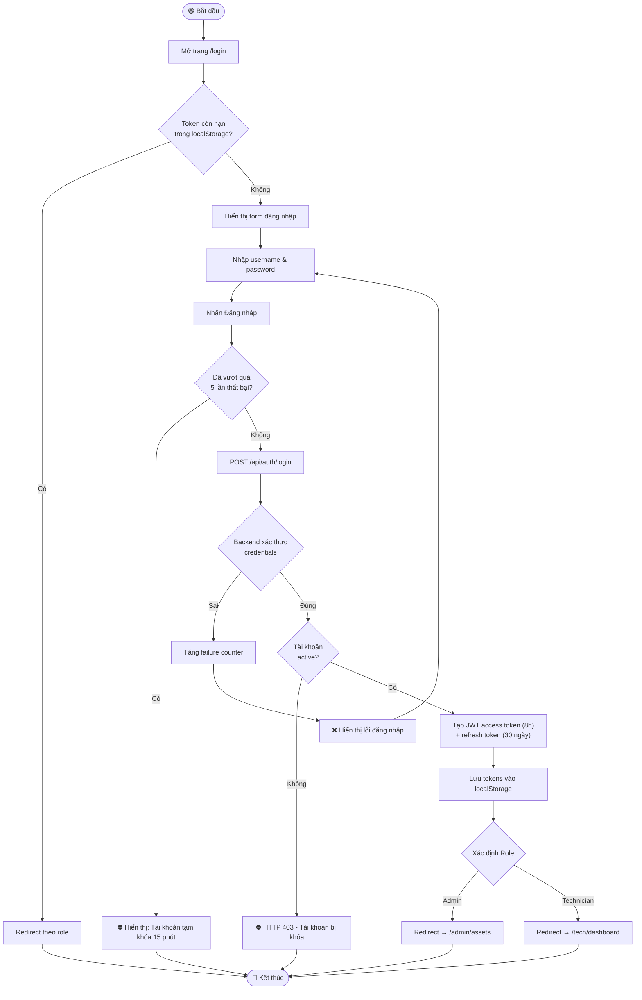
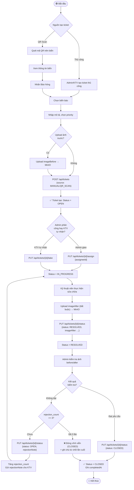
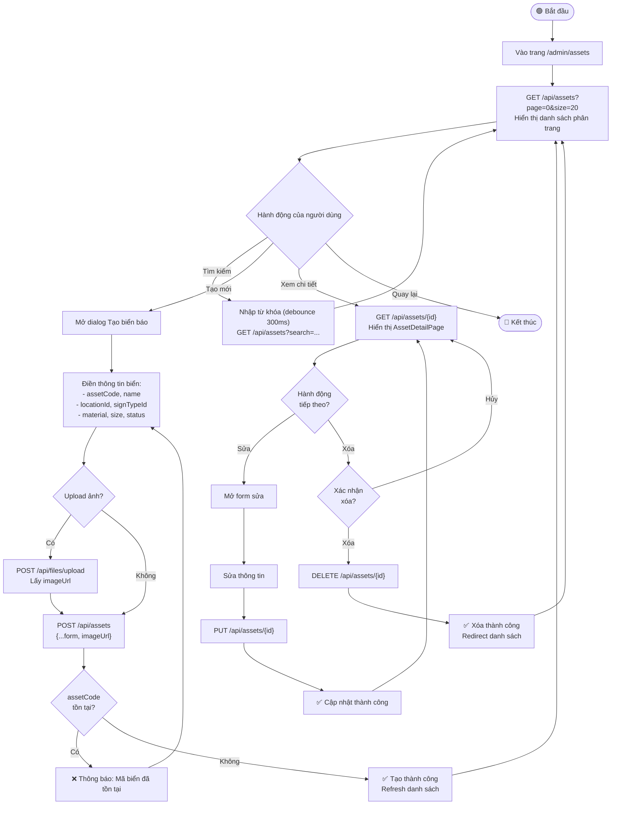
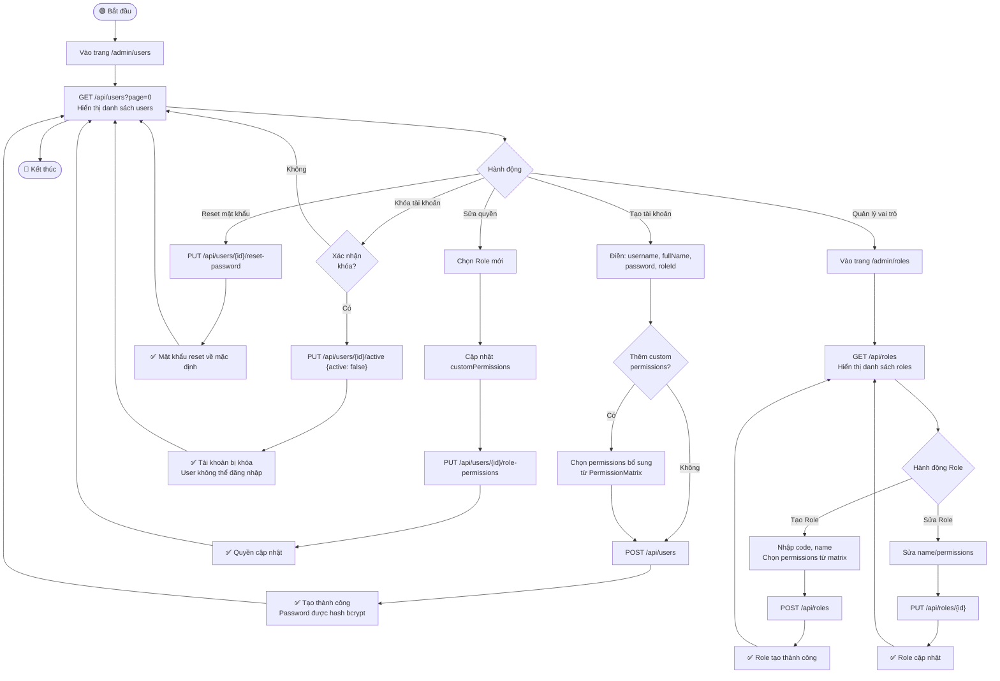
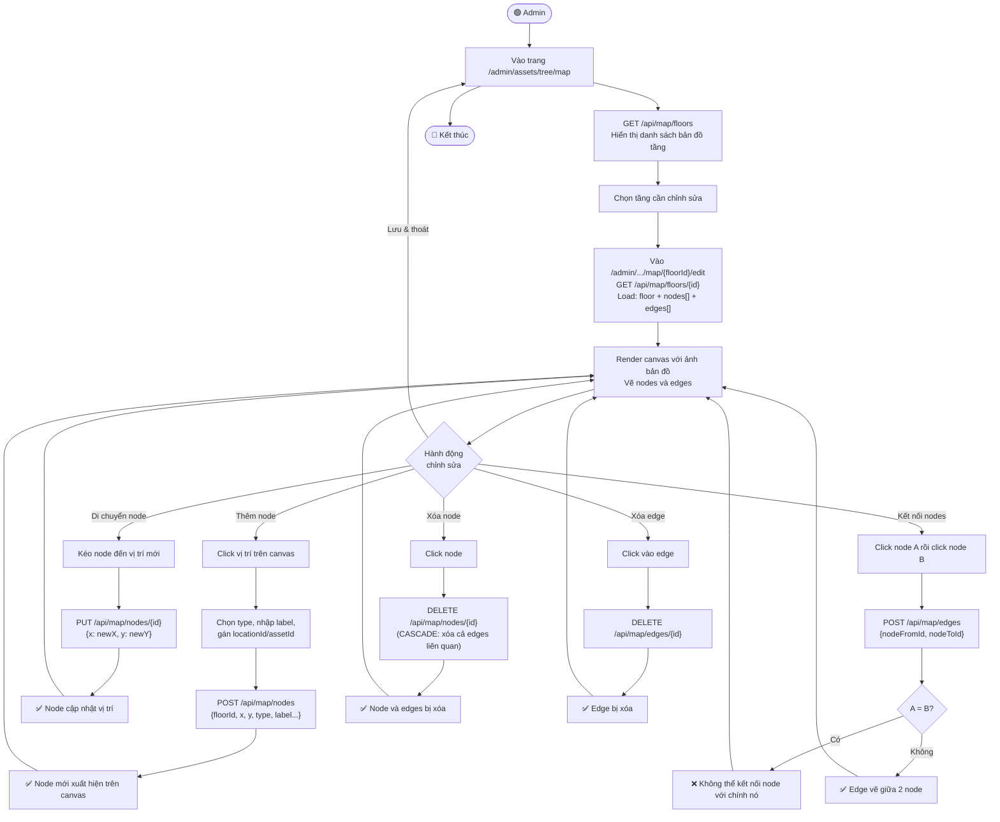

# 4. Activity Diagram
## Hệ Thống Quản Lý Biển Báo Bệnh Viện

---

## 4.1 Đăng Nhập Hệ Thống



---

## 4.2 Quy Trình Tạo & Xử Lý Ticket Bảo Trì



---

## 4.3 Quản Lý Biển Báo (Asset CRUD)



---

## 4.4 Điều Hướng Nội Bộ (Wayfinding)

```mermaid
flowchart TD
    Start([🟢 Bệnh nhân/Khách]) --> OpenMap[Mở trang /map]
    OpenMap --> LoadFloors["GET /api/map/floors\nHiển thị danh sách tầng"]
    LoadFloors --> SelectFrom[Chọn điểm xuất phát\n(Location dropdown)]
    SelectFrom --> SelectTo[Chọn điểm đến\n(Location dropdown)]
    SelectTo --> ToggleStairs{Tránh\ncầu thang?}
    ToggleStairs -->|Bật| SetAvoid[avoidStairs = true]
    ToggleStairs -->|Tắt| SetNoAvoid[avoidStairs = false]
    SetAvoid --> FindPath
    SetNoAvoid --> FindPath
    FindPath["GET /api/map/wayfinding\n?from=&to=&avoidStairs="] --> ParseResult{Tìm thấy\nđường đi?}
    ParseResult -->|Không| ShowNoPath["⚠️ Không tìm được đường\nCó thể do không liên thông"]
    ParseResult -->|Có| RenderPath[Vẽ đường đi trên bản đồ\nHighlight các node]
    RenderPath --> ShowSteps[Hiển thị hướng dẫn từng bước:\n1. Đi thẳng đến ...\n2. Rẽ phải vào ...\n3. Đến nơi!]
    ShowSteps --> UserChoice{Người dùng\nlàm gì?}
    UserChoice -->|Tìm đường khác| SelectFrom
    UserChoice -->|Kết thúc| End([🔴 Kết thúc])
    ShowNoPath --> SelectFrom
```

---

## 4.5 Quản Lý Người Dùng & Phân Quyền



---

## 4.6 Chỉnh Sửa Bản Đồ (Map Editor)


