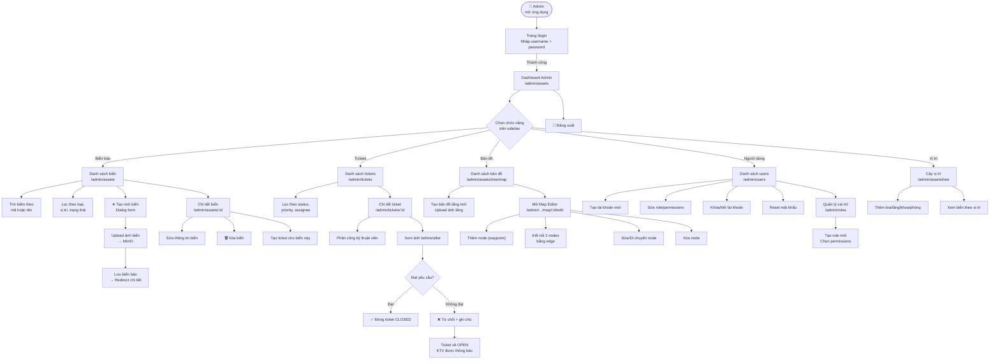
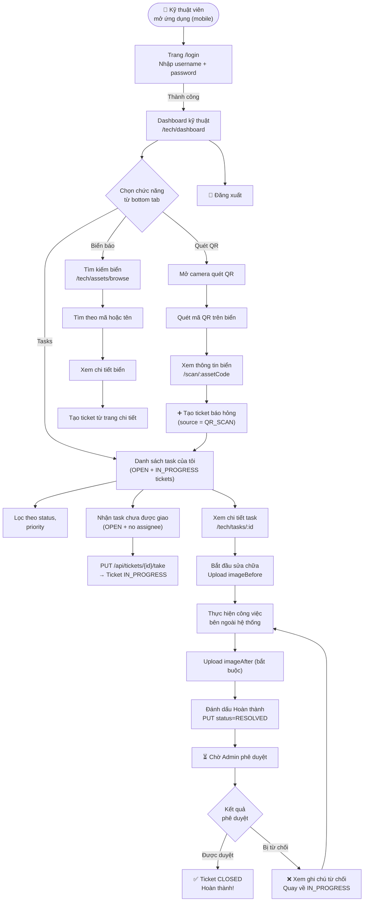
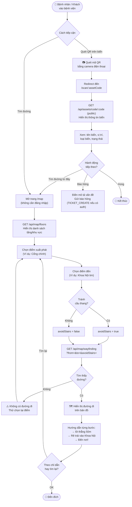
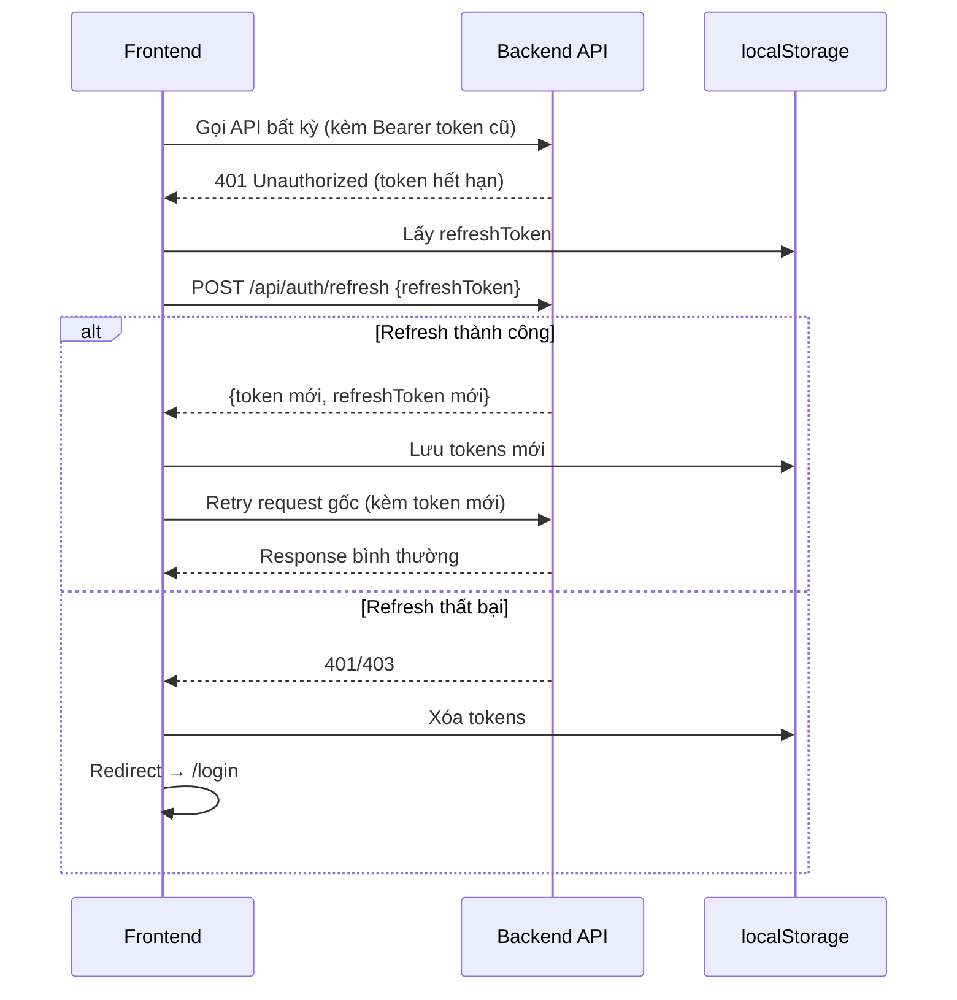

# 5. User Flow
## Hành Trình Người Dùng - Hệ Thống Quản Lý Biển Báo Bệnh Viện

---

## 5.1 User Flow: Quản Trị Viên (Admin)

---

## 5.2 User Flow: Kỹ Thuật Viên (Technician)

---

## 5.3 User Flow: Bệnh Nhân / Khách Vãng Lai (Public)

---

## 5.4 User Flow: Token Refresh (Tự Động)

