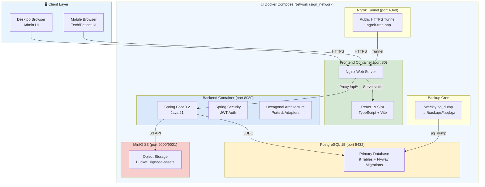
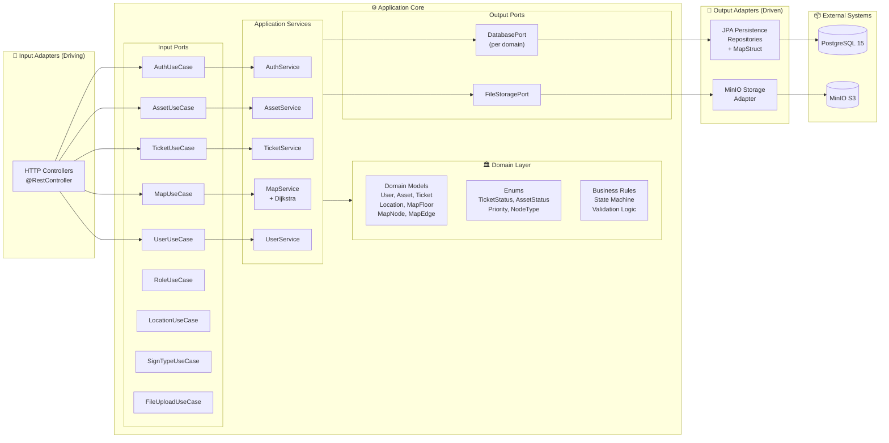
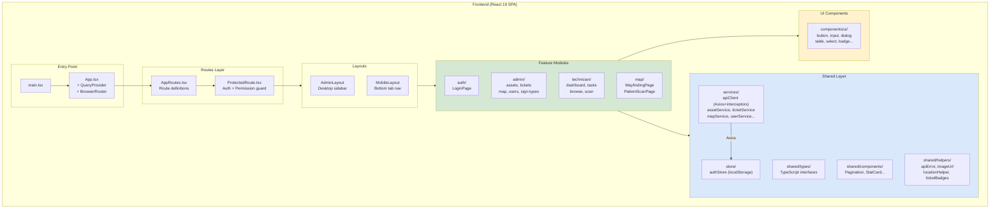
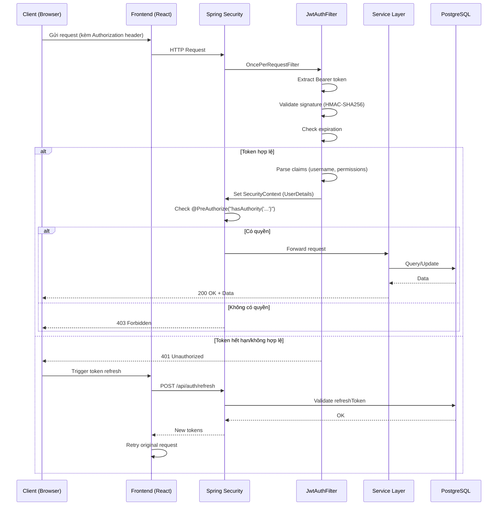
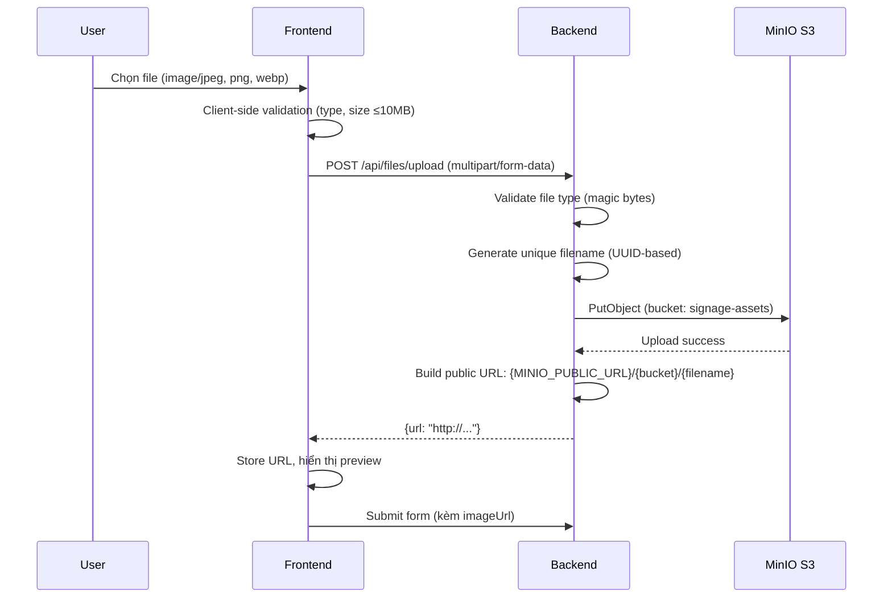
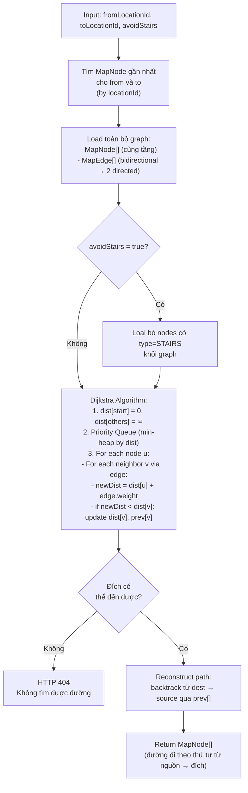
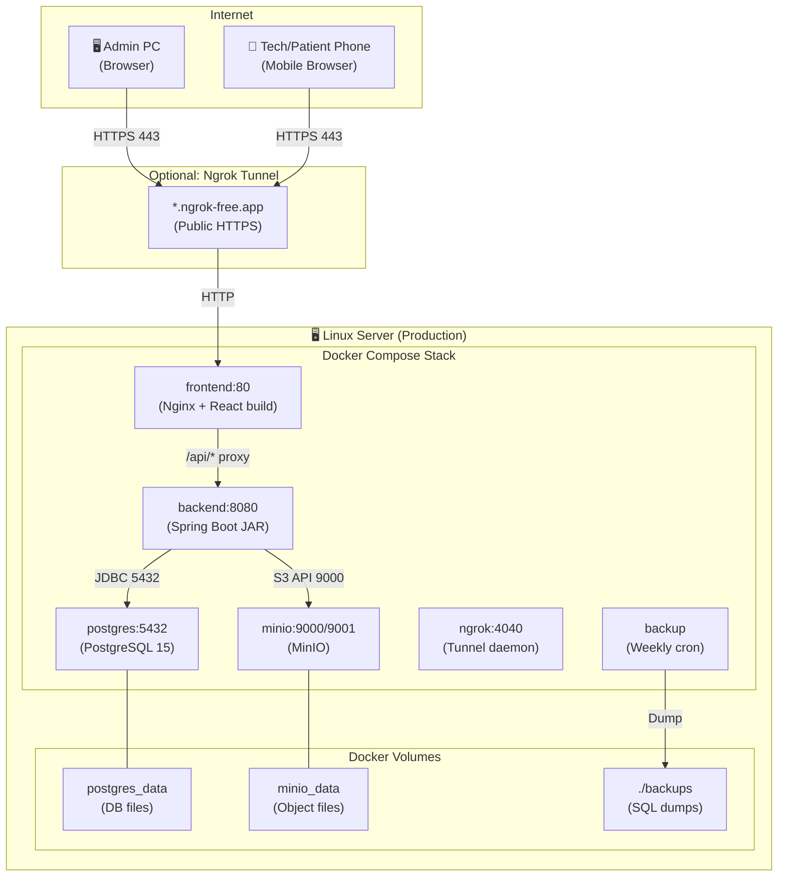

# 6. System Architecture Document (SAD)
## Hệ Thống Quản Lý Biển Báo Bệnh Viện

**Phiên bản:** 1.0  
**Ngày:** 2026-06-10

---

## 6.1 Kiến Trúc Tổng Thể

---

## 6.2 Kiến Trúc Backend — Hexagonal (Ports & Adapters)

---

## 6.3 Kiến Trúc Frontend — Feature-First

---

## 6.4 Luồng Xác Thực & Phân Quyền

---

## 6.5 Luồng Upload File

---

## 6.6 Thuật Toán Tìm Đường (Dijkstra)

---

## 6.7 Mô Hình Triển Khai

---

## 6.8 Các Module Hệ Thống

| Module | Chức Năng | Tech Layer |
|--------|-----------|-----------|
| **Auth Module** | Đăng nhập, JWT, Refresh Token, Rate Limiting | Security + JPA |
| **Asset Module** | CRUD biển báo, tìm kiếm, phân trang | Service + JPA + MinIO |
| **Location Module** | Cây vị trí (Building/Floor/Department/Room) | Service + JPA |
| **Ticket Module** | State machine bảo trì, phân công, nghiệm thu | Service + JPA + MinIO |
| **Map Module** | Editor bản đồ, Node/Edge CRUD, Dijkstra | Service + JPA |
| **User Module** | CRUD tài khoản, phân quyền RBAC | Security + JPA |
| **Role Module** | CRUD vai trò, permission matrix | Security + JPA |
| **SignType Module** | Danh mục loại biển | Service + JPA |
| **File Module** | Upload/lưu trữ ảnh | MinIO Adapter |
