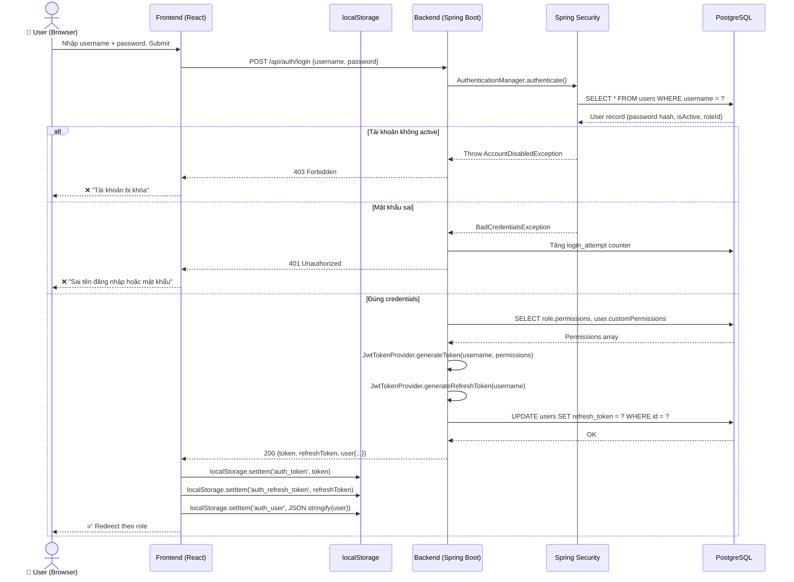
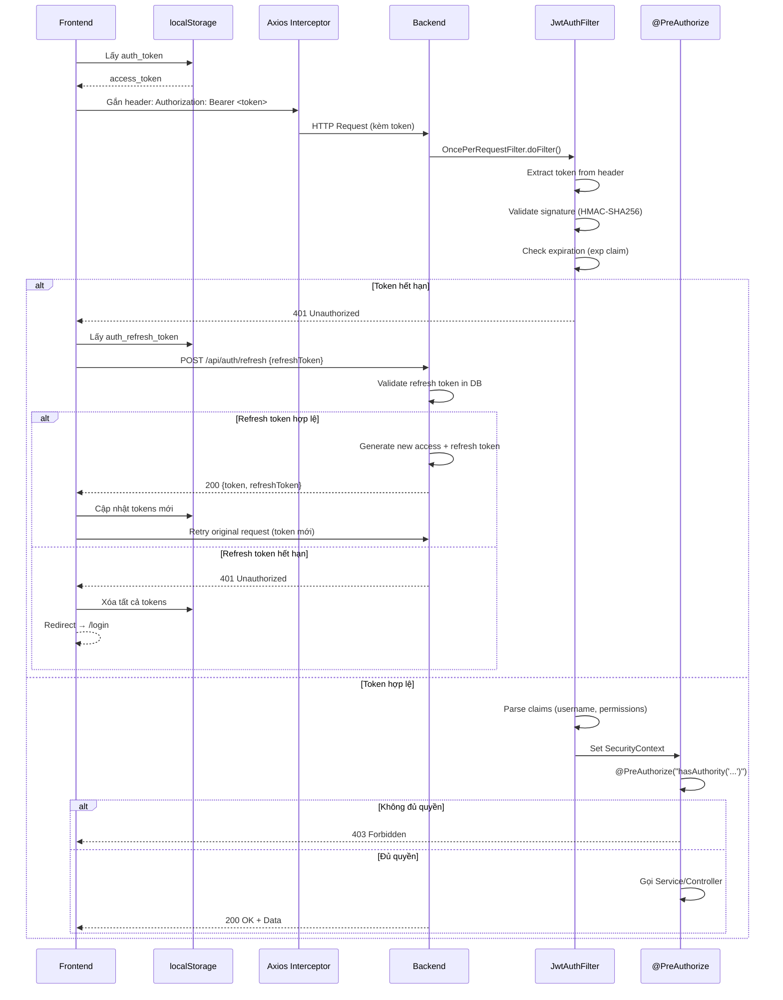
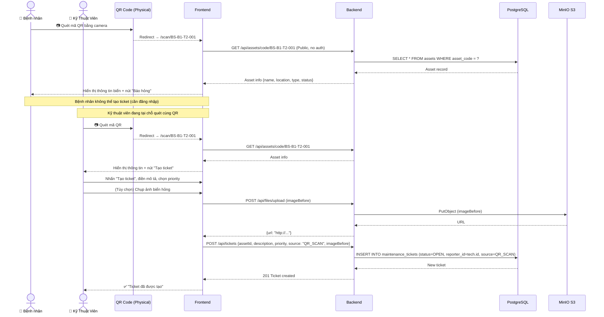
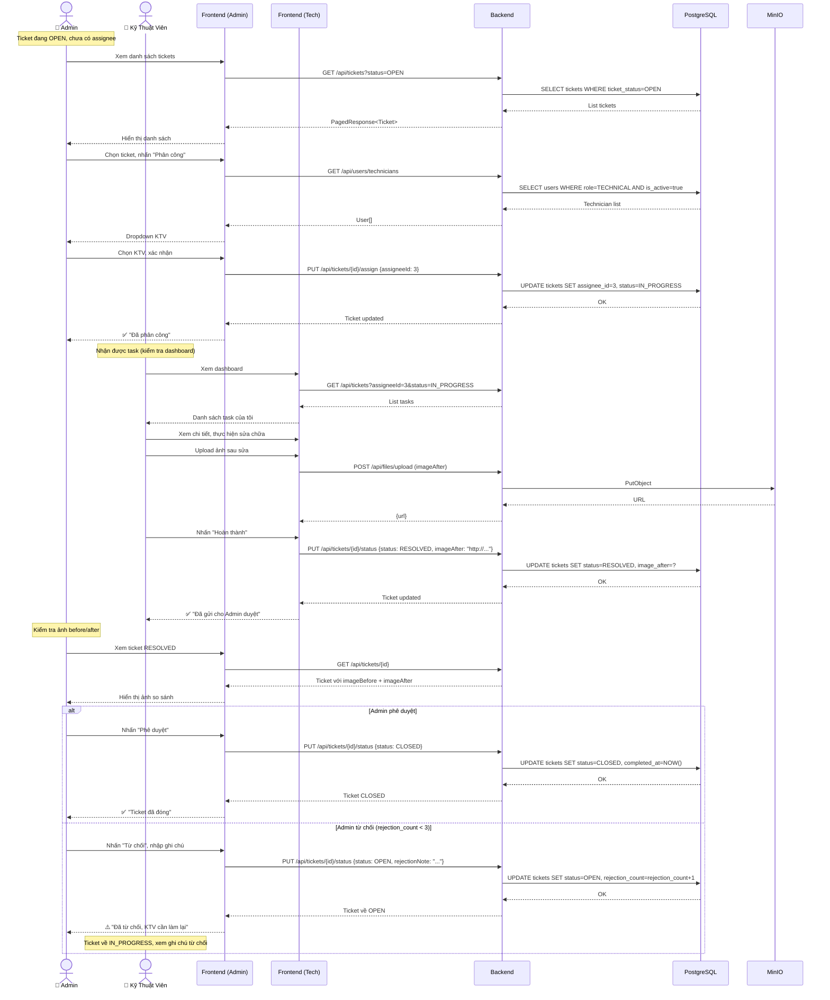
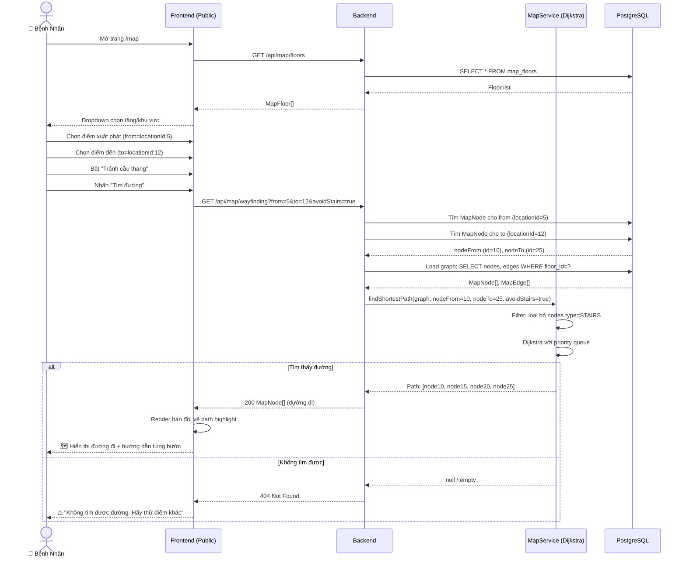
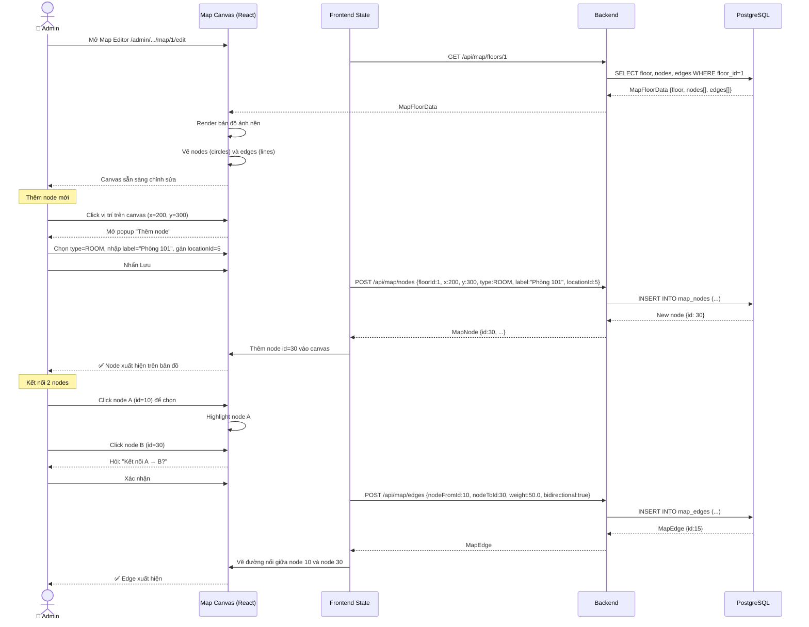

# 9. Sequence Diagram
## Hệ Thống Quản Lý Biển Báo Bệnh Viện

---

## 9.1 Đăng Nhập & Lấy Token

---

## 9.2 Gọi API Được Bảo Vệ (Protected API Call)

---

## 9.3 Tạo Ticket Từ QR Scan

---

## 9.4 Quy Trình Xử Lý Ticket (Admin → KTV → Admin)

---

## 9.5 Tìm Đường Wayfinding (Public)

---

## 9.6 Chỉnh Sửa Bản Đồ (Admin Map Editor)

